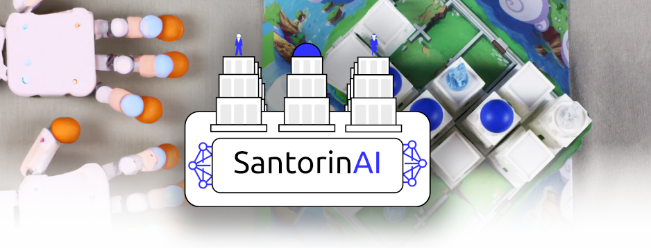
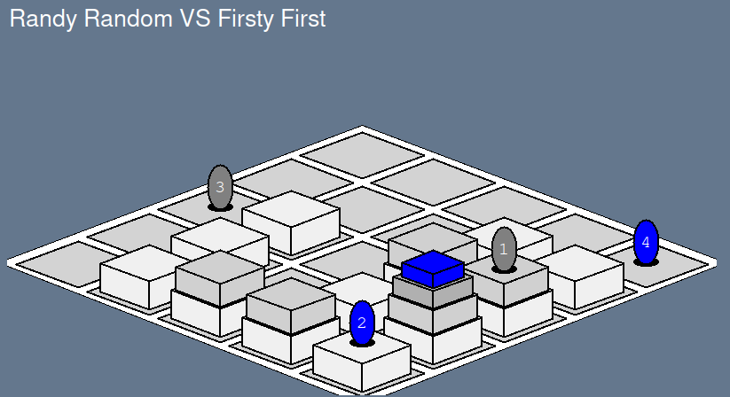

# SantorinAI

AI Player tester for the Santorini game

## How to use

### 1. Install

With pip:

```bash
pip install --upgrade santorinai
```

You can also clone the repository and install it manually:

```bash
git clone https://github.com/Tomansion/SantorinAI.git
cd SantorinAI
pip install -r requirements.txt
pip install .
```

### 2. Create a player

Create an override of the `Player` class in the `santorinai.player.py` file.

```python
from santorinai import Board, Pawn, Player
from random import choice


class MyPlayer(Player):
    """
    My player description
    """

    def __init__(self, player_number):
        super().__init__(player_number)
        # Do some initialization here

    def name(self):
        """
        Provide a name to your player
        """
        return "My player name"

    # Placement of the pawns
    def place_pawn(self, board: Board, pawn: Pawn):
        """
        Place a pawn

        Args:
            board (Board): A copy of the current board state
            pawn (Pawn): The pawn to place

        Returns:
            tuple: A position on the 5x5 board
        """
        # Do some magic here to choose a position
        my_choice = choice(board.get_possible_movement_positions(pawn))

        return my_choice  # A position on the 5x5 board

    # Movement and building
    def play_move(self, board: Board):
        """
        Play a move

        Args:
            board (Board): A copy of the current board state

        Returns:
            tuple: (pawn_number, move_position, build_position)
        """

        # This function is called when the player needs to play

        my_pawn_1 = board.get_playing_pawn(1)
        my_pawn_2 = board.get_playing_pawn(2)

        board.board  # A 5x5 array of integers representing the board
        # 0: empty
        # 1: tower level 1
        # 2: tower level 2
        # 3: tower level 3
        # 4: terminated tower

        # Do some magic here to choose a position
        my_pawn_to_move_choice = choice([my_pawn_1, my_pawn_2])
        my_pawn_possible_moves = board.get_possible_movement_and_building_positions(
            my_pawn_to_move_choice
        )

        if len(my_pawn_possible_moves) == 0:
            return None, None, None

        my_move_and_build_choice = choice(my_pawn_possible_moves)

        my_move_position = my_move_and_build_choice[0]
        my_build_position = my_move_and_build_choice[1]

        # Return the selected pawn to move (1 or 2), the move position
        # and the build position
        # If my move is not valid, the tester will consider it as a forfeit
        return my_pawn_to_move_choice.order, my_move_position, my_build_position
```

Check our random players example in [our player examples folder](./santorinai/player_examples/) to help you create your own.

### 3. Test your player

```python
from santorinai import Tester, RandomPlayer
from my_player import MyPlayer

# Init the tester
tester = Tester()
tester.verbose_level = 2 # 0: no output, 1: Each game results, 2: Each move summary
tester.delay_between_moves = 0.1 # Delay between each move in seconds
tester.display_board = True # Display a graphical view of the board in a window

# Init the players
my_player = MyPlayer(1)
random_payer = RandomPlayer(2)

# Play some games
wins, details = tester.play_1v1(
    player1=my_player,
    player2=random_payer,
    nb_games=5,
)
print(wins)
print(details)
```

Output example:

```
Results:
Player My player won 4 times (80%)
Player Randy Random won 1 time (20%)

# Wins
{
    "My player name": 4,
    "Randy Random": 1,
}

# Details
{
    "My player name": {
        "The player pawn reached the top of a tower.": 3,
        "The next player is stuck, the game is over.": 1,
    },
    "Randy Random": {
        "The player pawn reached the top of a tower.": 1
    },
}
```

Graphical output example:


## Board utilities

We provide some utilities to help you manipulate the board.

```python
# Game information
board.nb_players # Number of players in the game (2 or 3)
board.nb_pawns # Number of pawns (4 or 6) depending on the game mode
board.player_turn # The number of the player currently playing (between 1 and 3)
board.turn_number # Number of turn played since the beginning of the game

# Pawns
board_pawns = board.pawns # The other pawns on the board
pawn = board_pawns[0] # The first pawn on the board
pawn.pos # The position a pawn on the board (x, y), or (None, None) if it is not placed yet
pawn.number # The number of the  pawn on the board (between 1 and 6) depending on the game mode
pawn.player_number # The number of the player owning the pawn (between 1 and 3) depending on the game mode


# Board
board_array = board.board # A 5x5 array of integers representing the board
# 0: empty
# 1: tower level 1
# 2: tower level 2
# 3: tower level 3
# 4: terminated tower

# Movements
available_move_positions = board.get_possible_movement_positions(pawn)
available_build_positions = board.get_possible_building_positions(pawn)

# Board control
board.place_pawn(pos) # Place the current playing pawn on the board
board.play_move(pawn.order, move_position, build_position) # Play a move (move and build) with the current playing pawn, and go to the next turn
board.is_game_over() # True if the game is over
board.winner_player_number # The number of the player who won the game

# Other
board.is_position_valid(position)
board.is_move_possible(start_pos, end_pos)
board.is_position_within_board(pos)
board.is_position_adjacent(pos1, pos2)
board.is_pawn_on_position(pos)
board.is_build_possible(builder_pos, build_pos)
board.copy() # Create a copy of the board, useful to test moves
print(board) # Print the board

# Display
from santorinai.board_displayer.board_displayer import init_window, update_board
window = init_window([player1.name(), player2.name()])
update_board(window, board)
```

## Credits

Creator of Santorini: [Roxley Games](https://roxley.com/)

Board 2D Gui library: [PySimpleGUI](https://www.pysimplegui.org/en/latest/)

## License

This project is licensed under the Apache License 2.0 - see the [LICENSE](LICENSE) file for details

## Contributors

- [Tomansion](http://github.com/tomansion)
- [daniPclos](https://github.com/daniPclos) (Implementation of the pawn selection on move feature)
